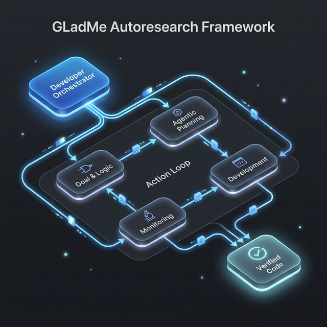

# GLadMe Sandbox (open-dj6)



This repository is the pre-configured sandbox for the **Gautam Lab Agentic Development Method (GLadMe)**. 

It uses a lightweight Django + React template (`open-dj6`) as a structural substrate, and relies on **Claude Code** and the **Autoresearch Skill** as the agentic engine to drive continuous learning, coding, and verification loops.

Instead of replicating complex features like semantic search, file parsing, and git operations, this sandbox lets you focus on defining the `Goal`, structuring the `Logic`, and writing your mechanical `Metric`, while a specialized Coder/Reviewer agent handles the execution.

It includes:
- A pre-configured Django + React + Vite environment with tests (`pytest`) and types (`tsc`) acting as mechanical verifiers.
- The `runstack` CLI shortcut for easy backend execution.
- (Recommended) The Autoresearch Claude Code skill for enforcing the GLadMe iterative loop.

## The GLadMe Agentic Loop

This sandbox is designed to be driven by AI. To start iterating:

1. Ensure Claude Code is installed globally (`npm i -g @anthropic-ai/claude-code`).
2. Install the Autoresearch skill globally (`cp -r autoresearch/skills/autoresearch ~/.claude/skills/autoresearch` or similar).
3. Start the continuous learning loop by running `claude` and invoking the skill:

```text
/autoresearch
Goal: Increase python test coverage while adhering to architectural rules.
Scope: web/**/*.py, tests/**/*.py
Metric: Pass rate (higher is better)
Verify: pytest
```

Claude will autonomously review code, plan an atomic change, write the code, run `pytest`, keep passing improvements, and auto-revert failed code—learning with each iteration.

## Quick Start

3. Install Python dependencies with poetry.

```bash
poetry install
```

2. Install frontend dependencies.

```bash
npm install
```

3. Create your local environment file.

```bash
cp .env.example .env
```

4. Run migrations.

```bash
./runstack migrate
```

5. Start Django and Vite in separate terminals.

```bash
./runstack runserver
```

```bash
npm run dev
```

6. Open `http://localhost:8000`.

## Template Shape

```text
open-dj6/
  config/                  Django settings and URL config
  common/models/           Base models and mixins
  common/services/         Base gateway, Protocol contract, registry
  ai/                      OpenRouter gateway and example command
  web/                     Example app, model, and Inertia view
  templates/               Base Django layout for Inertia
  frontend/                React entrypoint, pages, and styles
  tests/                   Pytest suite for the reusable seams
```

## Example OpenRouter Command

Once `OPENROUTER_API_KEY` is set:

```bash
./runstack ai_chat "Give me a short release note for this project."
```

Optional flags:

- `--system-prompt`
- `--model`
- `--temperature`
- `--max-tokens`

## Extension Notes

Keep the starter understandable by adding complexity only where it pays for itself.

- Add your own domain models by subclassing `BaseModel` or `SoftDeleteMixin, BaseModel`.
- Keep service interfaces narrow. If a provider only needs `chat_messages()`, do not add a broad
  platform abstraction around it.
- If you need a custom user model, set `AUTH_USER_MODEL` and the audit fields will follow it.
- If you later add more AI providers, register them through `common.services.registry`.

## Testing

Run the backend test suite with:

```bash
pytest
```
